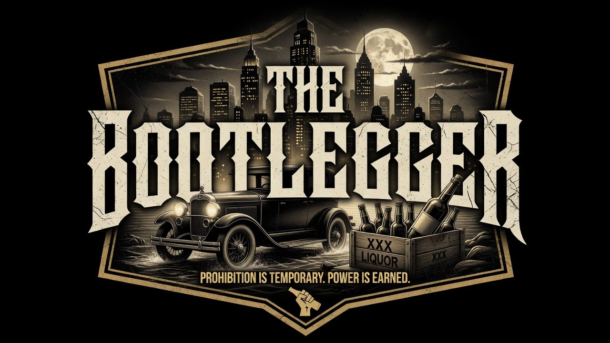

# The Bootlegger



**Harbor City, 1920.** An open-world crime game set in the first year of Prohibition.
You are the newest man on Salvatore Moretti's payroll: run the trucks, run the speakeasy,
and keep your name out of the papers.

Built entirely in vanilla HTML5/JavaScript — no dependencies, no build step.

## Play

**Play online:** https://jbarlek3-web.github.io/The-Bootlegger/ (deployed automatically
from `main` via GitHub Pages).

Or run it locally — open `index.html` in any modern browser, or serve the folder:

```
python3 -m http.server 8000
# then visit http://localhost:8000
```

## Controls

| Key | Action |
|---|---|
| WASD / Arrows | Move (walk or drive) |
| E | Talk, use doors, enter/exit the truck |
| Q | Step out of the truck |
| Space | Throw a punch |
| T | Wait one hour |
| J | Pocket notebook (jobs, side dealings, allies, pressure clocks) |
| M | City map |
| H | Help card |
| Esc | Menu (save/load) / close panels |
| 1–9 | Choose dialogue options |
| F2 | Debug / telemetry overlay |

## The Game

### The story
Eight structured jobs take you from errand boy to made man: the first dock run, opening
The Blind Tiger, putting a beat cop on the payroll, the Canadian rye run past a federal
checkpoint, buying a judge, settling the O'Banion problem, and hosting the Alderman's
people on the big night. Sal hands out the work from his office at Moretti Import Co.

### The rackets
- **Rum-running** — move crates by truck from Pier 7, the border warehouse, Hollis's farm
  still, or Frankie the fence, and drop them down the cellar chute in the alley behind the
  Café Roma. Cops who see a loaded truck get suspicious; suspicion becomes pursuit;
  pursuit becomes fines and confiscation. Night is your friend. So are back roads.
- **The Blind Tiger** — the speakeasy pays out every night it's open and wet (9 PM–3 AM).
  Set drink prices against demand, hire a doorman and a piano man, court the society
  crowd, and watch the raid odds. Every night is a ledger entry.

### The people
Fifteen named characters across every stratum of the city — a bribable beat cop, a
crusading temperance preacher, a purchasable judge, a widow who watches the street, a
reporter who trades in stories, a jazz singer, a moonshining farmer, a rival gang boss —
plus street crowds with rumors of varying reliability. Negotiation, information,
alliances, and conflict all run through dialogue; most problems have more than one
solution (cash, leverage, reputation, or fists).

### Pressure clocks — the world moves if you don't
Two faction timelines advance on their own (see **Pressure** in your notebook):

- **The O'Banion push** — once the Tiger opens, the north side starts counting your
  wagons. Left unanswered, they hijack your stock nightly until you settle it — by
  cash, by leverage from the Herald's crime desk, by reputation, or by force.
- **Bureau attention** — sustained heat brings federal agents to town, and eventually a
  midnight sweep. Lay low to send them home, or go dark on the right night and let them
  axe an empty café.

### Information economy
Word comes in grades: free street rumors are right about three times in five; Mickey the
Hack sells the straight dope for a nickel. Spend for certainty, or gamble on gossip.

### Two reputations
**REP** is your standing with the outfit — it opens missions and lets you talk instead of
pay. **COMMUNITY** is the neighborhood — it fills the Tiger's tables and shields your
truck from watchful eyes, because neighbors who like you don't rat.

## For tinkerers

Every gameplay constant — speeds, prices, demand curves, suspicion rates, clock lengths —
lives in one exposed object in [`js/tuning.js`](js/tuning.js). Tweak, reload, replay.
The F2 overlay shows live state-scoped telemetry (FPS, suspicion, clocks, forecasts)
while you tune.

| File | What it owns |
|---|---|
| `js/core.js` | Namespace, state, event bus, input |
| `js/tuning.js` | Every tunable number, in one place |
| `js/world.js` | Harbor City map, collision, tile rendering |
| `js/entities.js` | Player, truck, NPCs, police AI, combat |
| `js/dialogue.js` | Dialogue tree engine |
| `js/speakeasy.js` | The Tiger: demand model, raids, nightly ledger |
| `js/npcs.js` | The cast: dialogue trees, side quests, locations |
| `js/missions.js` | Story arc, pressure clocks, the game clock |
| `js/ui.js` | HUD, panels, notebook, maps |
| `js/save.js` | localStorage save/load |
| `js/main.js` | Boot, interaction, game loop, debug overlay |

Saves live in `localStorage` (autosave every morning at 8 AM).

---
*A work of historical fiction. Harbor City and everyone in it are inventions.*
